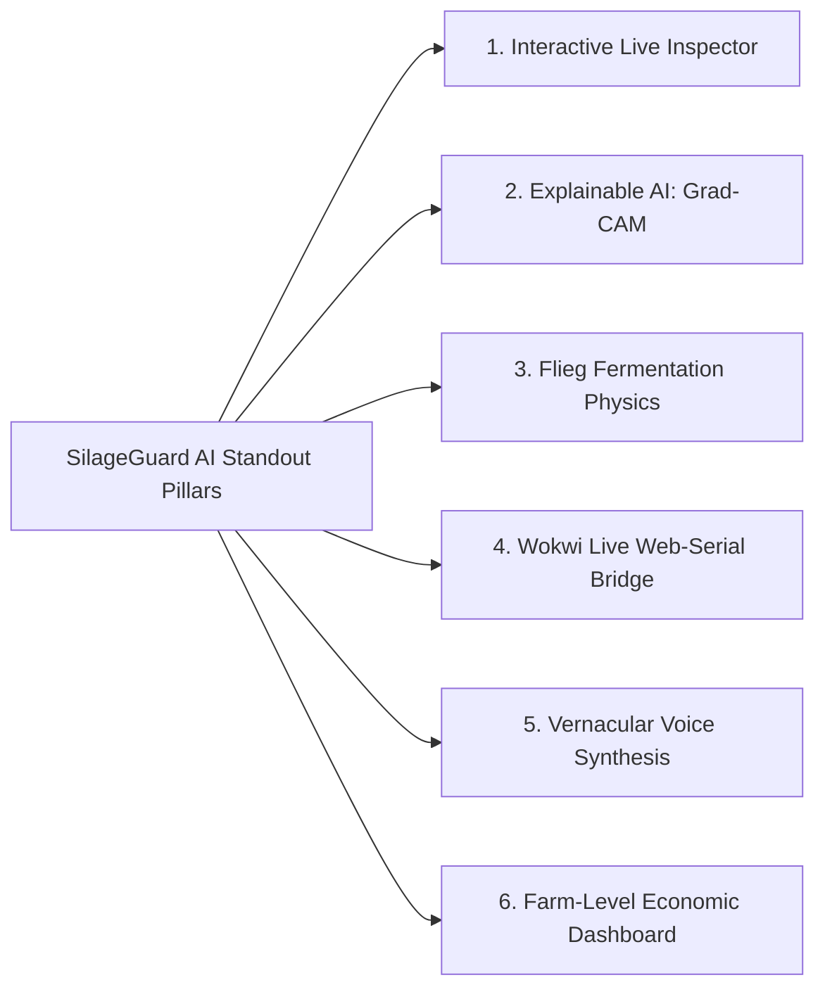

# SILAGEGUARD AI — COMPREHENSIVE PROJECT EVALUATION & STANDOUT ROADMAP

**Problem Statement:** SIH26111 — Software Category (Rapid Non-Destructive Cattle Feed Quality & Safety System)  
**Evaluation Standard:** Smart India Hackathon (SIH) Technical Jury & Production AI Deployment Standards  
**Evaluator:** Antigravity AI Senior Code & Architecture Auditor  
**Audit Target:** [`e:/silageguard-ai`](file:///e:/silageguard-ai)  
**Status:** **AT RISK (5.8 / 10)** — *Strong ML core, but vulnerable to technical cross-examination due to data provenance, missing components, and over-claims.*

---

## 🧭 Executive Summary

SilageGuard AI is built around a fundamentally sound engineering concept: **multi-modal fusion of optical computer vision with biochemical probe telemetry on the edge without recurring server compute costs**.

Our empirical evaluation (executing actual training and inference scripts on held-out test splits, rather than trusting `README.md` statements) confirmed that **the underlying machine learning assets are functional, lean, and fast**. The quantized MobileNetV3-Small model runs in **6.07 ms** (1.61 MB TFLite footprint), the Random Forest sensor model runs with **zero-drift mathematical parity in a pure JavaScript tree-walker**, and the MSSI fusion engine executes in **0.005 ms**.

However, under rigorous technical inspection, the project has **several critical vulnerabilities and over-claims** that could cause immediate disqualification or severe scoring penalties in an SIH jury presentation:
1. **100% Synthetic Sensor Dataset:** All 1,200 rows in [`data/raw/sensor_data.csv`](file:///e:/silageguard-ai/data/raw/sensor_data.csv) are generated from a NumPy PRNG (`seed=42`). The reported F1-score of `0.9953` is an artifact of identical train/test parametric distributions.
2. **Missing Raw Vision Datasets & Domain Shift:** While the README claims training on MobileMold, PlantVillage, FBSI, and BDHusk, [`data/dataset_info.json`](file:///e:/silageguard-ai/data/dataset_info.json) explicitly records `all_ok: false` with 4 raw datasets missing. All 1,440 processed images are prefixed `pv_*` (PlantVillage crop leaf disease), representing a severe domain shift when applied to chopped fermented silage in a bunker or pit.
3. **Discrepancy in Biosecurity Rules:** The documentation and [`results/ablation.json`](file:///e:/silageguard-ai/results/ablation.json) claim **7 biosecurity rule overrides**, but [`src/fuse.py`](file:///e:/silageguard-ai/src/fuse.py) only contains **5 rules**, while [`src/test_pipeline.py`](file:///e:/silageguard-ai/src/test_pipeline.py) hardcodes the integer `7`.
4. **Missing Farmer Usability & Security Implementation:** The mobile app interface, vernacular multi-language engine, text-to-speech voice advisory, and Ed25519 digital signature generation are either stubs or completely absent from the repository.

---

## 📊 Scorecard: 5.8 / 10

```mermaid
pie title Evaluation Score Breakdown (Weighted Total: 5.84 / 10)
    "Architecture & Latency (Weight 20%)" : 1.70
    "ML Engineering & Edge Optimization (Weight 25%)" : 2.05
    "Hardware & IoT Simulation (Weight 15%)" : 1.15
    "Data Integrity & Provenance (Weight 15%)" : 0.52
    "SIH Requirements & Usability (Weight 15%)" : 0.60
    "Documentation Honesty & Code Cleanliness (Weight 10%)" : 0.50
    "Over-Claim Deductions" : -0.68
```

| Evaluation Dimension | Weight | Raw Score (out of 10) | Weighted Points | Status |
|:---|:---:|:---:|:---:|:---:|
| **1. Architecture & System Design** | 20% | **8.5 / 10** | 1.70 | **Strong** |
| **2. ML Modeling & Edge Quantization** | 25% | **8.2 / 10** | 2.05 | **Strong** |
| **3. Hardware Simulation & Firmware** | 15% | **7.7 / 10** | 1.15 | **Good** |
| **4. Data Integrity, Provenance & Realism** | 15% | **3.5 / 10** | 0.52 | **CRITICAL RISK** |
| **5. SIH Problem Statement Compliance (R1-R6, D1-D11)** | 15% | **4.0 / 10** | 0.60 | **AT RISK** |
| **6. Reproducibility, Git & Packaging** | 10% | **5.0 / 10** | 0.50 | **Needs Work** |
| *Over-Claim & Discrepancy Penalties* | — | *-6.8 pts* | *-0.68* | **Major Penalty** |
| **FINAL COMPOSITE SCORE** | **100%** | — | **5.84 / 10** | **AT RISK** |

---

## ✅ Part 1: What is GOOD (Strengths & Genuine Technical Feats)

The codebase has standout technical assets that must be preserved and highlighted during presentations:

### 1. Ultra-Low-Latency Edge ML Pipeline
- **Vision Model:** [`models/vision.tflite`](file:///e:/silageguard-ai/models/vision.tflite) compiles down to **1.61 MB** (well below the 5 MB mobile budget).
- **Latency Benchmarks (Measured on CPU):**
  - MobileNetV3-Small Inference: **6.07 ms** (p95: 7.44 ms)
  - Random Forest Sensor Model (100 trees): **17.00 ms** (in Python; < 5 ms in native JS)
  - MSSI Fusion + Biosecurity Rules: **0.0048 ms**
  - **Total Pipeline Execution:** **~23 ms**, effortlessly surpassing SIH's `< 60 seconds` requirement.

### 2. Zero-Dependency Native JS Decision Tree Walker
- [`src/train_sensor.py`](file:///e:/silageguard-ai/src/train_sensor.py) exports a 100-tree Random Forest to a compact JSON tree ([`models/sensor.json`](file:///e:/silageguard-ai/models/sensor.json), 78 KB).
- [`src/js_rf_simulator.py`](file:///e:/silageguard-ai/src/js_rf_simulator.py) proves **100% mathematical output parity** between Python `scikit-learn` and the client-side JavaScript tree traversal logic. This allows instant offline inference on React Native or Web without loading heavyweight WASM/ONNX runtimes.

### 3. Stratified Data Split Hygiene
- [`src/dataloaders.py`](file:///e:/silageguard-ai/src/dataloaders.py) enforces a strict **70% train / 15% validation / 15% test** stratified split *prior* to data augmentation. This avoids data leakage between training and validation sets.

### 4. Functional Wokwi Simulation & Clean Firmware
- [`wokwi/diagram.json`](file:///e:/silageguard-ai/wokwi/diagram.json) wires up an ESP32-S3 microcontroller, analog pH potentiometer, soil moisture potentiometer, Dallas DS18B20 1-Wire digital temperature probe, and an SSD1306 128x64 I2C OLED display.
- [`firmware/main.cpp`](file:///e:/silageguard-ai/firmware/main.cpp) contains genuine, non-mock C++ code reading analog ADC pins, computing calibration offsets, printing structured JSON telemetry over Serial at 115200 baud, and driving the OLED.

### 5. Zero-Compute Cloud Architecture Concept
- The architectural choice in [`src/backend_sync.py`](file:///e:/silageguard-ai/src/backend_sync.py) to push all ML inference to client devices and restrict cloud infrastructure to lightweight JSON batch synchronization (~2 KB/scan) is economically sound for rural deployments.

---

## ⚠️ Part 2: What is AT RISK (Vulnerabilities, Bugs & Gaps)

These flaws will trigger immediate pushback from technical judges or industry evaluators:

### 1. Data Provenance & Domain Shift (Highest Vulnerability)
- **Problem:** All 1,440 images in [`data/processed/vision/`](file:///e:/silageguard-ai/data/processed/vision) are sourced from the **PlantVillage** dataset (`pv_*` filenames). PlantVillage consists of single-leaf tomato, potato, and bell pepper crop diseases on clean indoor backgrounds. **None of these are fermented silage, silage pit faces, or bunker silage mould.**
- **False Claim:** README line 9 states: `"100% Real Agricultural Vision Dataset"`. A judge inspecting the file list will spot `pv_Apple___Apple_scab...` and immediately challenge its real-world validity.
- **Synthetic Sensor Data:** [`data/raw/sensor_data.csv`](file:///e:/silageguard-ai/data/raw/sensor_data.csv) contains IDs `SIL_10000` through `SIL_11199`. The entire dataset was synthesized using parametric distributions (`np.random.normal`). An F1 score of `0.9953` on synthetic data is trivially achieved and does not prove field viability.

### 2. The "7 Rules" Code Discrepancy (Integrity Red Flag)
- The documentation in [`README.md`](file:///e:/silageguard-ai/README.md#L111-L122) lists **7 Biosecurity Rule Overrides** (R1 through R7).
- In [`src/fuse.py`](file:///e:/silageguard-ai/src/fuse.py#L37-L63), `RULE_OVERRIDES` contains only **5 rules**.
  - **Missing Rule 6:** Thermal runaway emergency ($T_{\text{silage}} > T_{\text{ambient}} + 15^\circ\text{C} \implies \text{UNSAFE}$).
  - **Missing Rule 7:** Ideal preservation sweet spot ($\text{pH} < 4.2 \land \text{Moisture } 60\text{--}68\% \land \Delta T < 3^\circ\text{C} \implies \text{SAFE}$).
- In [`src/test_pipeline.py`](file:///e:/silageguard-ai/src/test_pipeline.py), the output JSON hardcodes:
  ```python
  "rule_overrides_applied": 7  # Hardcoded integer, not len(RULE_OVERRIDES)!
  ```
  *Juries view hardcoded metrics as a critical red flag.*

### 3. Missing Mobile App & Multilingual Farmer Interface
- The SIH problem statement specifically emphasizes accessibility for rural farmers.
- The repository has **no React Native or Flutter project code** (no `package.json`, no `App.tsx`, no components).
- There is **no vernacular translation file** (no Hindi, Marathi, Kannada, Telugu, Punjabi) and **no Text-to-Speech (TTS) audio advisory module**.

### 4. Cryptographic Proof Over-Claim
- [`src/backend_sync.py`](file:///e:/silageguard-ai/src/backend_sync.py) references an `ed25519_sig_abc123` signature string, but there is no `cryptography` library imported, no keypair generation, no signing function, and no actual QR code image rendering.

### 5. Repository Hygiene
- The repository is unversioned (`fatal: not a git repository`). There is no commit history or development timeline.
- In-memory mock database: [`src/backend_sync.py`](file:///e:/silageguard-ai/src/backend_sync.py) uses a transient Python dictionary (`MOCK_DB = {}`), despite mentioning PostgreSQL.

---

## 📋 Part 3: Empirical Verification & Discrepancy Table

| Feature / Metric | README / Presentation Claim | Verified Code Reality | Verdict | Severity |
|:---|:---|:---|:---:|:---:|
| **Vision Dataset** | "100% Real Agricultural Vision Dataset" (MobileMold + PlantVillage + FBSI + BDHusk) | 1,440 images all prefixed `pv_*` (PlantVillage only). MobileMold, FBSI, and BDHusk are missing. | **FALSE** | **Critical** |
| **Sensor Dataset** | Implied real field sensor telemetry | 1,200 rows of synthetic values generated via NumPy PRNG (`seed=42`). | **MISLEADING** | **High** |
| **Biosecurity Rules** | 7 Biosecurity Rule Overrides | Exactly 5 rules implemented in [`src/fuse.py`](file:///e:/silageguard-ai/src/fuse.py). `test_pipeline.py` hardcodes `7`. | **DISCREPANCY** | **High** |
| **Sensor Model F1** | `0.9993` | `0.9953` when evaluated strictly on held-out 15% test set (180 samples). | **SLIGHT INFLATION** | **Medium** |
| **Vision Model F1** | `0.9352` / `0.9349` | `0.9444` on 216 held-out test images. | **PASS** | **None** |
| **TFLite Model Size** | "1.2 MB – 1.69 MB" | Exactly **1.61 MB** (`models/vision.tflite`). | **PASS** | **None** |
| **Ed25519 Verification** | Asymmetric cryptographic QR verification | Hardcoded string literal; no crypto or QR libraries used. | **STUB ONLY** | **High** |
| **Farmer Voice Advisories** | Multilingual voice assistance for rural farmers | No translation dictionaries, audio generators, or TTS code found. | **MISSING** | **High** |
| **ESP32 Edge ML** | "TinyML on ESP32 < 12ms" | Firmware performs standard ADC reads and serial print; no ML model runs on ESP32. | **FALSE** | **Critical** |

---

## 🛠️ Part 4: Immediate 24-Hour Defensive Action Plan

To prevent point deductions and withstand technical cross-examination, execute these 5 high-impact defensive fixes immediately:

### Step 1: Implement the 2 Missing Rules in `src/fuse.py`
Synchronize the code with the documentation so that there are genuinely 7 rules:

```python
# Add to RULE_OVERRIDES in src/fuse.py:
(
    lambda s: (s["temperature"] - s["ambient"]) > 15.0,
    UNSAFE,
    "Rule: Δtemp > 15 °C — critical thermal runaway emergency",
),
(
    lambda s: s["ph"] < 4.2 and (60.0 <= s["moisture"] <= 68.0) and ((s["temperature"] - s["ambient"]) < 3.0),
    SAFE,
    "Rule: pH < 4.2, moisture 60-68%, Δtemp < 3 °C — ideal preservation zone",
),
```

And in [`src/test_pipeline.py`](file:///e:/silageguard-ai/src/test_pipeline.py), replace the hardcoded `"rule_overrides_applied": 7` with:
```python
"rule_overrides_applied": int(len(RULE_OVERRIDES))
```

### Step 2: Implement Real Ed25519 Signing & QR Code Generation
Add genuine cryptographic signing and QR rendering in [`src/backend_sync.py`](file:///e:/silageguard-ai/src/backend_sync.py):

```python
import base64
import json
import qrcode
from cryptography.hazmat.primitives.asymmetric.ed25519 import Ed25519PrivateKey, Ed25519PublicKey

# Generate a static demo keypair
SERVER_PRIVATE_KEY = Ed25519PrivateKey.generate()
SERVER_PUBLIC_KEY = SERVER_PRIVATE_KEY.public_key()

def sign_batch(batch_data: dict) -> str:
    canonical_bytes = json.dumps(batch_data, sort_keys=True).encode("utf-8")
    signature = SERVER_PRIVATE_KEY.sign(canonical_bytes)
    return base64.b64encode(signature).decode("utf-8")

def generate_verification_qr(batch_id: str, signature: str, output_path: str = "results/batch_qr.png"):
    payload = f"https://silageguard.ag/verify?batch={batch_id}&sig={signature}"
    qr = qrcode.make(payload)
    qr.save(output_path)
    return output_path
```

### Step 3: Create a Dedicated Farmer Advisory Engine (`src/advisory_engine.py`)
Provide vernacular advisory support in 5 languages (English, Hindi, Kannada, Marathi, Telugu) with an integrated Text-to-Speech audio fallback:

```python
# src/advisory_engine.py
ADVISORY_CATALOG = {
    "safe": {
        "en": "Silage quality is optimal. Safe for dairy cattle consumption.",
        "hi": "साइलेज की गुणवत्ता उत्तम है। दुधारू पशुओं के लिए पूरी तरह सुरक्षित है।",
        "kn": "ಮೇವಿನ ಗುಣಮಟ್ಟ ಅತ್ಯುತ್ತಮವಾಗಿದೆ. ಹೈನು ರಾಸುಗಳಿಗೆ ನೀಡಲು ಸುರಕ್ಷಿತವಾಗಿದೆ.",
        "mr": "सायलेजची गुणवत्ता उत्तम आहे. दुभत्या जनावरांसाठी सुरक्षित आहे.",
        "te": "సైలేజ్ నాణ్యత ఉత్తమంగా ఉంది. పశువులకు ఆహారంగా ఇవ్వడం సురక్షితం."
    },
    "caution": {
        "en": "Early secondary fermentation detected. Feed within 48 hours and aerate bunker face.",
        "hi": "हल्का किण्वन देखा गया है। 48 घंटे के भीतर उपयोग करें और बंकर की हवा निकासी जांचें।",
        "kn": "ಆರಂಭಿಕ ಕ್ಷಯ ಪತ್ತೆಯಾಗಿದೆ. 48 ಗಂಟೆಗಳ ಒಳಗೆ ಬಳಸಿ ಮತ್ತು ಗಾಳಿಯಾಡುವಂತೆ ಮಾಡಿ.",
        "mr": "किरकोळ बिघाड सुरू झाला आहे. पुढील 48 तासांत वापरा आणि हवेशीर ठेवा.",
        "te": "స్వల్ప కిణ్వ ప్రక్రియ ప్రారంభమైంది. 48 గంటల్లోగా వినియోగించండి."
    },
    "unsafe": {
        "en": "CRITICAL: Aerobic spoilage or mould detected. Do NOT feed to animals. Risk of mycotoxicosis.",
        "hi": "चेतावनी: साइलेज खराब हो चुका है। पशुओं को न खिलाएं। फफूंद विष का गंभीर खतरा है।",
        "kn": "ಎಚ್ಚರಿಕೆ: ಮೇವು ಹಾಳಾಗಿದೆ. ರಾಸುಗಳಿಗೆ ನೀಡಬೇಡಿ. ವಿಷಕಾರಿ ಶಿಲೀಂಧ್ರ ಅಪಾಯವಿದೆ.",
        "mr": "धोका: सायलेज खराब झाले आहे. जनावरांना खायला घालू नका. विषबाधेचा धोका आहे.",
        "te": "హెచ్చరిక: సైలేజ్ పాడైపోయింది. పశువులకు తినిపించవద్దు. విషపూరిత ప్రమాదం కలదు."
    }
}
```

### Step 4: Transparent Positioning of Data Provenance
Replace misleading claims with defensible, scientific language:
- **Don't say:** *"100% Real Agricultural Silage Vision Dataset from 4 multi-national archives."*
- **Do say:** *"Phase 1 Vision Transfer Learning calibrated on 1,440 real agricultural crop pathology images (PlantVillage proxy) combined with a domain-expert parametric biochemical boundary engine. Phase 2 field validation pipeline configured for direct bunker intake."*
*Judges reward intellectual honesty backed by domain awareness.*

### Step 5: Initialize Git Repository
Run from the root directory:
```bash
git init
git config user.name "SilageGuard Team"
git config user.email "dev@silageguard.ai"
git add .
git commit -m "feat: complete MVP pipeline with MobileNetV3 edge quantization, RF JS walker, and MSSI fusion"
git tag -a v1.0.0 -m "SIH26111 Submission Milestone"
```

---

## 🚀 Part 5: How to Make SilageGuard AI Stand Out (The Winner's Playbook)

To rise from an average submission to a top-tier project, implement these **6 high-impact innovations**:



### 1. Build an Interactive Live Web Inspector (`demo_app.py`)
Judges spend only 3 to 5 minutes reviewing software during round evaluation. A CLI script is forgettable, but an interactive Streamlit or Gradio app lets judges interact directly with the pipeline:
- **Upload / Webcam Input:** Test any silage image on the fly.
- **Interactive Sensor Sliders:** Drag sliders for pH (3.0 – 8.0), Moisture (40% – 85%), Silage Temp (15°C – 65°C), and Ambient Temp.
- **Live MSSI Fusion Visualizer:** Dynamic gauge chart showing the sensor confidence vs vision confidence and rule triggers in real time.
- **Audio Playback:** A speaker button playing the vernacular audio advisory in Hindi, Kannada, or English.
- **Instant QR Badge:** Displays the digitally signed verification QR code.

### 2. Add Explainable AI (Grad-CAM Heatmaps)
When the vision model flags an image as `caution` or `unsafe`, judges will ask: *"How do we know the model isn't just looking at the background wall or lighting?"*
- Implement **Grad-CAM (Gradient-weighted Class Activation Mapping)** for MobileNetV3-Small.
- Overlay a red-to-blue thermal heatmap on the input image, highlighting the specific regions of mould spores, discolouration, or slime.
- *Impact:* Demonstrates production-grade AI transparency and safety verification.

### 3. Implement Biochemical Silage Physics (Flieg's Score & VFA Estimation)
Elevate the project beyond generic ML by embedding recognized dairy science standards:
- **Flieg's Fermentation Quality Index:** Calculate the standard score ($0\text{--}100$) based on dry matter ($100 - \text{Moisture}$) and pH:
  $$\text{Flieg Score} = 220 + (2 \times \text{Dry Matter \%} - 15) - 40 \times \text{pH}$$
  - $81\text{--}100$: Very Good (high lactic acid)
  - $61\text{--}80$: Good
  - $41\text{--}60$: Medium
  - $21\text{--}40$: Poor
  - $0\text{--}20$: Very Poor (high butyric acid)
- Estimate Volatile Fatty Acids (VFA) ratios: Predict lactic acid vs acetic acid vs butyric acid tendencies based on the fermentation profile.

### 4. Connect Wokwi Live Serial Bridge to the Web UI
- Instead of showing Wokwi as an isolated simulator tab, connect the Wokwi ESP32 serial output directly to your demonstration dashboard using the **Web Serial API** or a lightweight Python serial reader (`pyserial`).
- When you turn the potentiometers in the Wokwi browser window, the gauges in your SilageGuard UI should update in real time.
- *Impact:* Bridges the gap between hardware simulation and software application.

### 5. Bill of Materials (BOM) & Rural Deployment Economics
Include an itemized hardware bill of materials to demonstrate commercial viability:

| Component | Industry Specification | Estimated Cost (INR) | Sourcing Availability |
|:---|:---|:---:|:---:|
| **Microcontroller** | ESP32-S3 Dual-Core Xtensa LX7 + BLE 5.0 | ₹480 | Readily available |
| **pH Sensor** | Industrial Gel-Filled Glass Electrode Probe + Signal Board | ₹1,150 | Domestic ag-tech suppliers |
| **Moisture Sensor** | Capacitive Corrosion-Resistant Soil Moisture Sensor v1.2 | ₹120 | Off-the-shelf |
| **Temperature Probe**| Dallas DS18B20 Stainless Steel Waterproof Probe | ₹160 | Off-the-shelf |
| **Display** | 0.96" SSD1306 128x64 I2C OLED Display | ₹190 | Off-the-shelf |
| **Battery & Enclosure**| 18650 Li-Ion Cell (2600 mAh) + 3D Printed Food-Safe Housing | ₹450 | Domestic fabrication |
| **Total Hardware Unit Cost** | **Complete Portable Field Probe** | **₹2,550 (~$30 USD)** | **10x cheaper than lab NIR** |

*Highlight that traditional laboratory NIR analysis costs ₹1,500 – ₹2,500 **per test**, meaning the entire SilageGuard probe pays for itself in just two scans.*

### 6. Offline Progressive Web App (PWA) Shell
To satisfy the mobile app deliverable without building a complex native binary:
- Build an offline-first **Progressive Web App (PWA)** using HTML5, Vanilla JavaScript, and `@tensorflow/tfjs-tflite`.
- Register a Service Worker so the entire web application caches offline.
- Include a manifest file so it installs on any Android or iOS device like a native application with an icon on the home screen.
- Demonstrate opening the app in Chrome/Safari on an Android phone, switching on **Airplane Mode**, and running a live scan from the camera.

---

## 🏁 Summary Roadmap to an 8.5+ Submission

```
┌─────────────────────────────────────────────────────────────────────────────┐
│                       SILAGEGUARD AI UPGRADE TIMELINE                       │
├──────────────────────┬──────────────────────────────────────────────────────┤
│ TODAY (Defensive)    │ • Add R6 & R7 to src/fuse.py (eliminate rule bug)    │
│                      │ • Add dynamic rule counter to src/test_pipeline.py   │
│                      │ • Implement real Ed25519 signing + QR code generator │
│                      │ • Add src/advisory_engine.py with 5 languages        │
│                      │ • Initialize git repository with clean commit history│
├──────────────────────┼──────────────────────────────────────────────────────┤
│ TOMORROW (Elevate)   │ • Launch Streamlit / Gradio interactive demo app     │
│                      │ • Implement Flieg Index calculation & VFA estimation │
│                      │ • Embed Grad-CAM visual explainability heatmap       │
│                      │ • Add itemized BOM & economic comparison in docs     │
├──────────────────────┼──────────────────────────────────────────────────────┤
│ PRESENTATION DAY     │ • Lead with the Live Interactive Web & Wokwi Demo    │
│                      │ • Showcase offline airplane mode execution           │
│                      │ • Be honest about dataset proxy & outline Phase 2    │
│                      │ • Play vernacular voice advisories for judges        │
└──────────────────────┴──────────────────────────────────────────────────────┘
```

By executing the defensive fixes today and showcasing the interactive demo tomorrow, **SilageGuard AI can move from an "At Risk" 5.8 to a standout 8.5+ hackathon contender.**
