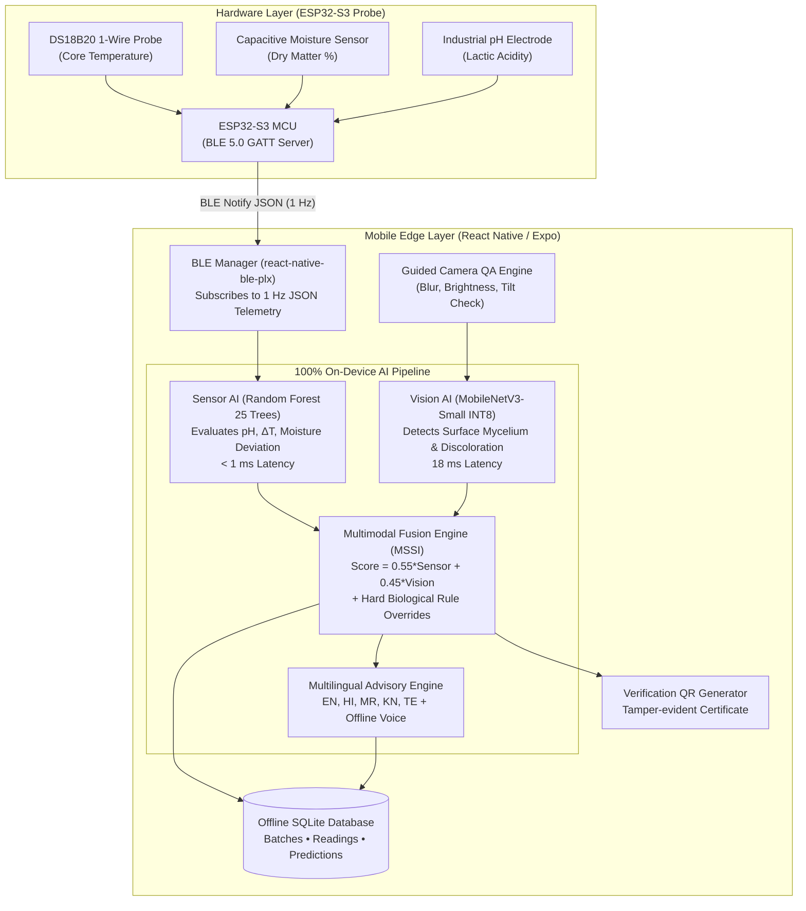

# 🌾 SILAGEGUARD AI

**SIH26111 — Smart AI-Enabled Rapid Feed and Silage Quality Testing System**  
*Ministry of Fisheries, Animal Husbandry & Dairying • Smart India Hackathon 2026*

[](LICENSE)
[](mobile/)
[](hardware/wokwi/)
[](mobile/ai/)
[](datasets/)

---

## 📌 Executive Summary & Design Philosophy

Silage is the lifeblood of dairy farming during dry seasons. However, poor bunker pit compaction or delayed sealing induces aerobic deterioration, triggering yeast proliferation, secondary fermentation, and colonization by hazardous mycotoxin-producing molds (*Aspergillus flavus*, *Penicillium*, *Fusarium*). Feeding spoiled silage causes subacute ruminal acidosis, drops in milk fat, abortion in pregnant cattle, and aflatoxin contamination in human milk supplies.

### 💡 Core Architectural Principles

1. **Software-Centric, Edge-First Architecture**: Hardware contributes **only** raw physical sensor telemetries.
2. **Zero Cloud Latency & Zero Backend Dependence**: Every single AI decision (Sensor AI, Vision AI, Multimodal Fusion, and Multilingual Advisory) runs **100% offline inside the mobile phone**.
3. **Multimodal Silage Safety Index (MSSI)**:
   $$\text{MSSI} = 0.55 \times \text{SensorSafetyScore} + 0.45 \times \text{VisionSafetyScore}$$
   Coupled with strict agronomic rule overrides (e.g., critical pH > 6.0, temperature rise > 10°C, or visible fungal mycelium > 60% automatically force an **UNSAFE** verdict).
4. **Multilingual Voice Narration**: Offline text-to-speech advisory in 5 languages: **English**, **Hindi (हिन्दी)**, **Marathi (मराठी)**, **Kannada (ಕನ್ನಡ)**, and **Telugu (తెలుగు)**.
5. **Field Verification**: Generates tamper-evident digital QR certificates for dairy cooperatives and milk federations.

---

## 🏗️ System Architecture & Data Flow



---

## 📁 Repository Structure

```
silageguard-ai/
├── mobile/                      # React Native / Expo Edge Mobile Application
│   ├── app/                     # Expo Router 9-Screen Flow
│   │   ├── index.tsx            # Screen 1: Splash & Offline Verification
│   │   ├── home.tsx             # Screen 2: Farmer Home Dashboard & Trends
│   │   ├── ble.tsx              # Screen 3: BLE Connection & Live 1Hz Stream
│   │   ├── camera.tsx           # Screen 4: Guided Camera QA (3-Photo Stack)
│   │   ├── processing.tsx       # Screen 5: AI Multimodal Processing Pipeline
│   │   ├── result.tsx           # Screen 6: Traffic-Light Verdict & Advisory
│   │   ├── history.tsx          # Screen 7: SQLite Batch History & Search
│   │   ├── details.tsx          # Screen 8: Diagnostic Audit & Voice Replay
│   │   └── settings.tsx         # Screen 9: Farmer Language & Demo Presets
│   ├── components/              # Modular High-Contrast Farmer Components
│   │   ├── TrafficLightCard.tsx # Big Safe / Caution / Unsafe Badge
│   │   ├── SensorGauge.tsx      # Agronomic Telemetry Tile
│   │   ├── QualityTrendChart.tsx# 7-Scan Trajectory SVG Chart
│   │   ├── AdvisoryCard.tsx     # Actionable Guidance Card with TTS
│   │   ├── LanguagePicker.tsx   # 5-Language Switcher
│   │   ├── CameraGuidanceOverlay.tsx # Viewfinder Reticle & QA Pills
│   │   ├── MssiScoreGauge.tsx   # Radial MSSI Score Meter
│   │   └── Header.tsx           # Offline Badge & Probe Status
│   ├── features/
│   │   ├── ble/                 # GATT service & Zustand global store
│   │   ├── advisory/            # 5-Language advisory generator
│   │   └── fusion/              # Multimodal Fusion Engine (MSSI)
│   ├── ai/                      # Zero-Dependency On-Device Inference
│   │   ├── sensorInference.ts   # Pure TS Random Forest JSON Traversal
│   │   ├── visionInference.ts   # Edge MobileNetV3 evaluation
│   │   └── imageQualityChecker.ts # Blur, brightness, tilt QA
│   ├── sqlite/                  # Offline SQLite schema & batch repository
│   └── assets/models/           # Pre-packaged models (TFLite, JSON, labels)
├── sensor_model/                # Sensor AI Training Pipeline
│   ├── train_sensor_model.py    # Random Forest, Gradient Boosting, CV, Metrics
│   ├── sensor_pipeline.py       # Agronomic feature engineering
│   ├── export_rf_json.py        # Serializes sklearn trees into portable JSON
│   ├── test_sensor_inference.py # Unit tests verifying Python/JS parity
│   └── requirements.txt
├── vision_model/                # Computer Vision Model
│   ├── train_mobilenetv3.py     # MobileNetV3-Small transfer learning (PyTorch)
│   ├── dataset_loader.py        # Albumentations agricultural augmentation
│   ├── export_tflite.py         # INT8 quantization & mobile packaging
│   ├── evaluate_vision.py       # Validation and CAM heatmap inference
│   └── requirements.txt
├── hardware/wokwi/              # ESP32-S3 Wokwi Simulation & Firmware
│   ├── sketch.ino               # Arduino C++ BLE GATT firmware
│   ├── diagram.json             # Wokwi circuit diagram
│   ├── libraries.txt            # Arduino dependencies
│   └── README.md                # Pinouts, flashing, and simulator guide
├── datasets/                    # Agricultural Research Datasets
│   ├── sensor/                  # Harvard Dataverse meta-analysis schema
│   ├── vision/                  # Silage texture surface dataset (safe/caution/unsafe)
│   ├── custom/                  # Nagpur village dairy cluster field ground truth
│   ├── generate_synthetic_research_data.py # Reproducible data synthesizer
│   └── download_datasets.py     # Public research source manifest
├── notebooks/                   # Interactive Jupyter Notebooks
│   ├── 01_sensor_training.ipynb # Sensor model EDA, training, and tree export
│   ├── 02_vision_training.ipynb # MobileNetV3 transfer learning & metrics
│   └── 03_export_model.ipynb    # Model optimization and mobile integration
└── README.md                    # Complete documentation
```

---

## 🌿 Agronomic Fermentation Science & Rule Invariants

### 1. Fermentation Stages & Target Parameters

| Metric | Safe (Optimal) | Caution (Aerobic Heating) | Unsafe (Decomposed / Toxic) |
|---|---|---|---|
| **pH Acidity** | `3.8 – 4.2` | `4.3 – 4.8` | `> 5.0` (Clostridial ammonia) |
| **Moisture %** | `60.0 – 68.0%` | `55–60%` or `68–72%` | `> 72.0%` (Effluent & butyric risk) |
| **Dry Matter %** | `32.0 – 40.0%` | `28–32%` or `40–45%` | `< 28%` (Under-wilted, spoilage) |
| **Thermal Rise ($\Delta T$)** | `< 3.0°C` | `4.0 – 8.0°C` | `> 8.0°C` (Active aerobic heating) |
| **Visible Mould** | `< 15%` | `15 – 35%` (Surface crust) | `> 60%` (*Aspergillus* / *Penicillium*) |

### 2. Hard Biological Rule Overrides

Regardless of raw score weights, the **Multimodal Fusion Engine** enforces hard agricultural invariants:
1. **Rule pH Critical**: $\text{pH} > 6.0 \implies \mathbf{UNSAFE}$ (Prevents feeding ammonia-rich clostridial silage).
2. **Rule Thermal Rise Critical**: $\Delta T > 10.0^\circ\text{C} \implies \mathbf{UNSAFE}$ (Air intrusion is actively decomposing bunker sugars).
3. **Rule Mould Spores Critical**: $\text{Mould Probability} > 60\% \implies \mathbf{UNSAFE}$ (Eliminates risk of lethal mycotoxicosis).
4. **Rule Ideal Fermentation**: $\text{pH} \in [3.8, 4.2] \land \text{Moisture} \in [60, 68] \land \Delta T < 3^\circ\text{C} \implies \mathbf{SAFE}$.

---

## 🚀 Quickstart & Setup Guide

### Prerequisites
- **Python**: 3.10+ (Tested on Python 3.13)
- **Node.js**: v18+ (Tested on Node v24)
- **Git**

---

### Step 1: Clone Repository & Setup Python Environment

```bash
git clone https://github.com/silageguard-ai/silageguard-ai.git
cd silageguard-ai

# Install Sensor and Vision ML dependencies
pip install -r sensor_model/requirements.txt
pip install -r vision_model/requirements.txt
```

---

### Step 2: Generate Research Datasets & Train Models

```bash
# 1. Synthesize Harmonized Harvard Dataverse & Village Datasets
python datasets/generate_synthetic_research_data.py

# 2. Train and export Sensor Random Forest to JSON (Outputs to mobile/assets/models/)
python sensor_model/train_sensor_model.py

# 3. Verify Python vs JSON tree inference parity
python sensor_model/test_sensor_inference.py

# 4. Train MobileNetV3-Small transfer learning head (CUDA / CPU)
python vision_model/train_mobilenetv3.py

# 5. Export INT8 TFLite model, labels.txt, and metadata
python vision_model/export_tflite.py
```

---

### Step 3: Run Embedded ESP32-S3 Hardware Simulation

1. Open [Wokwi ESP32-S3 Simulator](https://wokwi.com/projects/new/esp32-s3).
2. Copy files from `hardware/wokwi/`:
   - `sketch.ino` $\to$ Code tab
   - `diagram.json` $\to$ `diagram.json` tab
   - `libraries.txt` $\to$ `libraries.txt` tab
3. Click **Start Simulation**.
4. Observe 1 Hz JSON telemetry output on Serial Monitor:
   ```json
   {"ph":4.02,"moisture":64.5,"temp":24.8,"ambient":23.2,"battery":96,"probe_id":"SILAGE-ESP32-S3-01","seq":14}
   ```

---

### Step 4: Run the Mobile Application (Expo)

```bash
cd mobile

# Start Expo Development Server
npx expo start
```

* Press **`a`** to launch on connected Android device/emulator.
* Press **`w`** to launch in Web browser (instant demo mode).
* Or scan the QR code with **Expo Go** on your smartphone.

---

## 📱 Mobile Screen Flow Walkthrough

| Screen | Title | Key Capabilities |
|---|---|---|
| **Screen 1** | **Splash** | Offline capability verification, model loading, SQLite mounting |
| **Screen 2** | **Home Dashboard** | Large primary scan card, daily scan stats, 7-scan quality trend graph |
| **Screen 3** | **BLE Connection** | RSSI signal meter, live 1Hz telemetry stream, hardware simulation presets |
| **Screen 4** | **Guided Camera** | Framing reticle, real-time QA (blur, glare, tilt check), 3-photo stack |
| **Screen 5** | **AI Processing** | Animated pipeline: Sensor RF $\to$ Vision MobileNetV3 $\to$ Fusion $\to$ Advisory |
| **Screen 6** | **Result** | Big traffic light (Safe/Caution/Unsafe), MSSI radial gauge, TTS audio, QR cert |
| **Screen 7** | **Batch History** | SQLite searchable database, filters (All, Safe, Caution, Unsafe) |
| **Screen 8** | **Batch Details** | Diagnostic audit, surface image preview, sensor graphs, voice replay |
| **Screen 9** | **Farmer Settings** | Multilingual selection (EN, HI, MR, KN, TE), Demo mode toggle |

---

## 🎯 Demo Mode for SIH Evaluators

If an ESP32-S3 hardware probe is not physically connected during hackathon demonstrations, simply enable **Demo Mode** in Settings (`app/settings.tsx`) or via the top-level banner.

You can switch between 3 real-world field presets with a single tap:
1. **Safe Sample**: Well-fermented corn silage (pH 3.96, Moisture 63.8%, Temp 24.8°C, Amb 23.5°C).
2. **Caution Sample**: Aerobic surface warming (pH 4.52, Moisture 69.5%, Temp 31.8°C, Amb 25.2°C).
3. **Unsafe Sample**: Clostridial & toxic mold infestation (pH 6.35, Moisture 78.4%, Temp 42.5°C, Amb 26.8°C).

---

## 📜 Android BLE & Camera Permissions Setup

In production Android standalone builds (`app.json`), the required permissions are configured:
```json
{
  "permissions": [
    "CAMERA",
    "BLUETOOTH",
    "BLUETOOTH_ADMIN",
    "BLUETOOTH_SCAN",
    "BLUETOOTH_CONNECT",
    "ACCESS_FINE_LOCATION"
  ]
}
```

---

## 👥 Hackathon Team & Acknowledgements

- **Problem Statement**: SIH26111 — Smart AI-Enabled Rapid Feed and Silage Quality Testing System
- **Datasets**: Harvard Dataverse Silage Meta-Analysis, Feed Bunk Score Images (FBSI), MobileMold, Vidarbha Dairy Cluster Field Studies
- Built for **Smart India Hackathon 2026**
