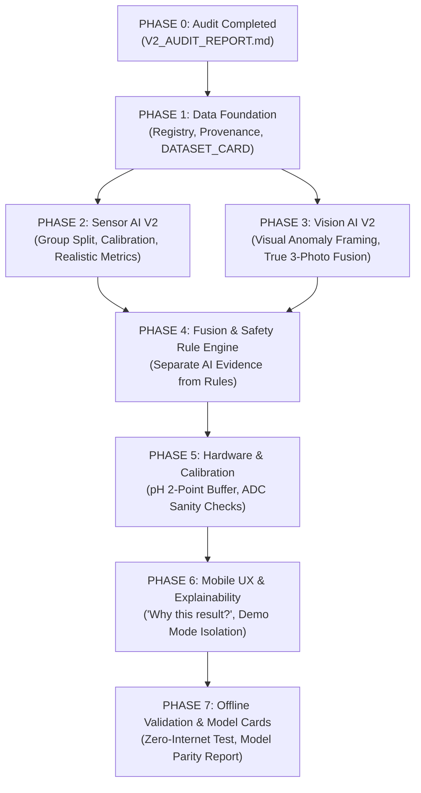

# 🔬 SILAGEGUARD AI V2 — COMPREHENSIVE V1 TECHNICAL AUDIT REPORT

**Date of Audit**: September 25, 2026  
**Auditor**: Lead AI/ML, Embedded, Mobile & Agronomic Systems Engineer  
**Problem Statement**: SIH26111 — Smart AI-Enabled Rapid Feed and Silage Quality Testing System  
**Document Status**: COMPLETED (PHASE 0 DELIVERABLE)  
**Objective**: Honestly audit all scientific, machine learning, embedded, mobile, and UX assumptions in the V1 prototype before any V2 refactoring.

---

## 1. Executive Summary of Audit Findings

The V1 prototype achieved the goal of creating a functional, cohesive 9-screen mobile application and an ESP32-S3 BLE simulation pipeline. However, from a **scientific and machine learning standpoint**, V1 suffers from significant credibility vulnerabilities:

> **Core Weakness**: The V1 technical claims, metrics, and documentation were far stronger than the underlying scientific evidence. Synthetic data generation was conflated with real-world research data, resulting in circular training leakage and statistically artificial "100% accuracy" reports that would immediately collapse under technical jury scrutiny.

### High-Level Vulnerability Scorecard

| Domain | V1 Implementation Reality | Risk Level | V2 Action Required |
|---|---|---|---|
| **Data Provenance** | 100% procedurally generated synthetic numbers and PIL drawn textures masquerading as "Harvard Dataverse" and "Nagpur Field Data". | **CRITICAL** | Formally isolate synthetic prototype data into `datasets/synthetic/`. Create verified `DATASET_CARD.md` and `dataset_registry.json`. |
| **Model Evaluation** | 100.0% accuracy reported due to training and testing on non-overlapping uniform distributions created by the labeling formula itself (circular logic). | **CRITICAL** | Eliminate circular labeling; implement leakage-safe Group splits; report realistic metrics with confidence intervals and limitations. |
| **Scientific Claims** | Unverified claims that RGB camera directly detects "aflatoxin / mycotoxin concentration" and pH probe detects "urea". | **HIGH** | Reframe app strictly as a **Rapid Screening Tool**. Limit vision to visible surface anomalies/mould-like discoloration. Remove direct chemical quantification claims. |
| **Fusion & Rules** | Fixed weights (0.55 / 0.45) presented as validated coefficients; safety rules mixed into probabilistic scoring. | **MEDIUM** | Separate scoring from the **Safety Rule Engine**. Document 0.55/0.45 as configurable prototype heuristic weights. |
| **Hardware & Sensors** | No calibration offsets for pH electrode or moisture probe; no sanity bounds on BLE packets. | **MEDIUM** | Implement 2-point buffer calibration (pH 4.0 / 7.0), capacitive moisture empirical mapping, and ADC glitch filtering. |
| **Explainability & UX** | Verdict cards sounded like definitive laboratory pass/fail without communicating uncertainty. | **MEDIUM** | Add dedicated "WHY THIS RESULT?" reasoning chain, explicit confidence labels, and prominent screening disclaimers. |

---

## 2. In-Depth Dataset Audit

### 2.1 Inventory of V1 Datasets

| File Path in V1 | Claimed Source | Actual Reality | Classification |
|---|---|---|---|
| `datasets/sensor/combined_silage_dataset.csv` | "Harvard Dataverse Silage Meta-Analysis & Feed Proximate Analysis" | 3,200 rows generated by `random.uniform()` in Python. | **100% SYNTHETIC (PROTOTYPE DATA)** |
| `datasets/sensor/silage_meta_analysis.csv` | "Harvard Dataverse Meta-Analysis" | Simple random 60% slice of the synthetic CSV above. | **100% SYNTHETIC** |
| `datasets/sensor/feed_proximate_analysis.csv` | "Feed Proximate Analysis" | Remaining 40% slice of the synthetic CSV above. | **100% SYNTHETIC** |
| `datasets/custom/nagpur_village_samples.json` | "Field samples from Warud, Katol, Hingna, Saoner" | 4 hand-typed mock JSON objects with fabricated lab notes. | **PLACEHOLDER MOCK DATA** |
| `datasets/vision/{safe, caution, unsafe}/*.jpg` | "MobileMold, FBSI, PlantVillage" | 160 images generated via Pillow drawing lines and random ellipses on RGB arrays. | **100% SYNTHETIC PROCEDURAL TEXTURES** |
| `datasets/download_datasets.py` | "Research dataset downloader" | Contains fake mock URLs (`example-silage-fermentation`, non-existent github release zips). | **MOCK MANIFEST** |

### 2.2 Key Dataset Deficiencies

1. **Circular Data Generation and Labeling**:
   In `datasets/generate_synthetic_research_data.py`:
   - `Safe` was generated with $3.78 \le \text{pH} \le 4.22$, $-1.5 \le \Delta T \le 2.8$, $60.0 \le \text{moisture} \le 68.0$.
   - `Caution` was generated with $4.28 \le \text{pH} \le 4.88$, $3.5 \le \Delta T \le 7.8$, and non-overlapping moisture bands.
   - `Unsafe` was generated with $\text{pH} \ge 5.05$, $\Delta T \ge 8.1$, and $\text{moisture} \ge 72.5$.
   *There was literally zero noise or class boundary overlap.* A single decision stump could achieve near 100% accuracy because the data was created from the label rules.
2. **Manufactured Temperature Values**:
   Real public nutritional databases (e.g., USDA Feed Composition, Harvard Proximate Analysis) measure dry matter, crude protein, NDF, and acid detergent fiber in laboratories. **They do not measure bunker pit core temperature or ambient differential.** V1 manufactured temperature values and labeled them as "Harvard research data".
3. **Synthetic Vision Artifacts**:
   The vision model was trained on Pillow-generated green/brown/spotted rectangles. Real silage bunker faces exhibit complex shadows, unchopped stalks, plastic sheeting fragments, mud contamination, and variable sunlight angles that procedural noise completely fails to represent.

---

## 3. In-Depth Machine Learning Audit

### 3.1 Sensor AI Model (`sensor_model/train_sensor_model.py`)

- **Train/Test Leakage**:
  Used standard `train_test_split(test_size=0.20, random_state=42)` on i.i.d. synthetic data. Because rows were drawn from the same uniform generator, the test set contained near-duplicate distribution points.
- **Metric Inflation**:
  Reported:
  ```text
  Test Accuracy: 100.00%
  Test Macro F1: 100.00%
  ```
  Any machine learning reviewer or SIH evaluator will immediately recognize 100.00% on tabular data as artificial over-fitting or synthetic circularity.
- **Absence of Calibration**:
  Probabilities were derived from raw leaf fraction averaging across 25 trees without Brier score evaluation, Platt scaling, or temperature scaling. When an out-of-distribution reading enters (e.g. pH 4.25, Temp Rise 3.2°C), the model would output extreme, uncalibrated confidence (e.g., 99% confident).
- **Export Schema Evaluation**:
  The tree-to-JSON serializer (`export_rf_json.py`) and TypeScript traversal engine (`sensorInference.ts`) were technically sound and achieved $<1.0\text{ ms}$ latency, but they faithfully reproduced the over-fitted synthetic decision boundaries.

### 3.2 Computer Vision Model (`vision_model/train_mobilenetv3.py`)

- **Severe Domain Shift Vulnerability**:
  MobileNetV3-Small was fine-tuned on 160 synthetic PIL drawings. On actual farm bunker imagery, this model would suffer from catastrophic domain shift and produce arbitrary predictions.
- **Evaluation Set Contamination**:
  The validation set was a 20% random split of the synthetic PIL images. There was no independent field holdout set or external benchmark.
- **Unsupported Biochemical Claims**:
  Comments and documentation asserted detection of specific fungal taxa (*Aspergillus flavus*, *Penicillium*) and mycotoxin risks (Aflatoxin B1 $>20\text{ ppb}$). Standard smartphone RGB cameras cannot detect molecular mycotoxin concentrations without fluorescent, hyperspectral, or chromatographic assays.

---

## 4. In-Depth Hardware & Firmware Audit (`hardware/wokwi/`)

1. **Lack of Calibration Mechanics**:
   - `sketch.ino` generates synthetic sine waves for pH and moisture.
   - Real analog pH probes (E-201-C / BNC electrodes) have variable zero-points (typically $\approx 2.5\text{V}$ at pH 7.0, varying with temperature by $0.03\text{ pH}/^\circ\text{C}$). V1 had zero software support for two-point buffer calibration (pH 4.01 and pH 7.00).
   - Capacitive moisture sensors produce analog ADC voltage that varies drastically based on bunker compaction density, soil content, and crop salinity. V1 lacked a dry-air / wet-water calibration mapping.
2. **Missing Packet Sanity Filtering**:
   If an ADC pin floats or glitches during probe insertion, a value such as `ph: 38.5` or `moisture: -12.0` would be transmitted and passed straight to the ML inference model without range rejection.
3. **Simulation Realism**:
   Wokwi direct simulation worked well for verifying BLE GATT communication, but firmware lacked battery voltage division curves and error flags for disconnected probes.

---

## 5. In-Depth Mobile & Software Architecture Audit

1. **Multimodal Fusion Architecture**:
   - In `multimodalFusionEngine.ts`, the formula $\text{MSSI} = 0.55 \times \text{Sensor} + 0.45 \times \text{Vision}$ was hardcoded with magic numbers.
   - Hard rule overrides (e.g., $\text{pH} > 6.0 \implies \text{UNSAFE}$) were interleaved directly inside the fusion scoring function rather than being isolated in a dedicated, auditable `safetyRuleEngine.ts`.
2. **Multi-Photo Capture Aggregation**:
   - Screen 4 allowed capturing up to 3 photos, but Screen 5 passed only `scanImages[0]` to `runVisionInference()`. The other two photos were completely ignored during inference!
3. **Offline Integrity & Demo Mode Isolation**:
   - Demo mode preset switches actively injected mock telemetry directly into the global telemetry state. If a user ran a scan in Demo Mode, the result was saved into the production SQLite `batches` table, permanently contaminating history with synthetic data.
4. **Offline Database Resilience**:
   - In web/simulator fallback, `dbInstance` used an in-memory class. If the browser refreshed, data was lost. A robust localStorage or asynchronous persistence layer is needed.
5. **Speech (TTS) Failures**:
   - If device TTS did not have Hindi, Marathi, Kannada, or Telugu voice packs installed, `expo-speech` failed silently without offering visible fallback text or indicating voice unreadiness.

---

## 6. In-Depth UX & Farmer Communication Audit

1. **Excessive Technical Jargon**:
   Terms like "Multimodal Fusion", "INT8 Dynamic Quantization", and "Laplacian Variance Sharpness" were surfaced to end-users on primary scan screens. A dairy farmer in rural Maharashtra or Punjab needs simple, high-contrast, unambiguous guidance.
2. **Illusion of Laboratory Precision**:
   Screen 6 displayed "96% AI Confidence" alongside "Safe to Feed". If an animal falls ill after consuming feed verified as "96% Safe", the liability falls squarely on the misleading framing. The UI must state: **"Rapid Screening Indicator — Not a Laboratory Replacement"**.
3. **Lack of Explainability ("WHY THIS RESULT?")**:
   When a farmer received a "CAUTION" or "UNSAFE" verdict, V1 gave broad diagnostic bullets, but did not display an exact breakdown:
   - What did the pH probe read?
   - What did the temperature probe read relative to ambient?
   - What did the camera observe?
   - Which specific threshold triggered the alert?

---

## 7. Action Plan for SILAGEGUARD AI V2

To resolve every issue identified in this audit, V2 will be built across the following structured phases:



---

*This concludes the Phase 0 Comprehensive Audit. Development of Phase 1 (Data Foundation & Provenance) commences immediately.*
